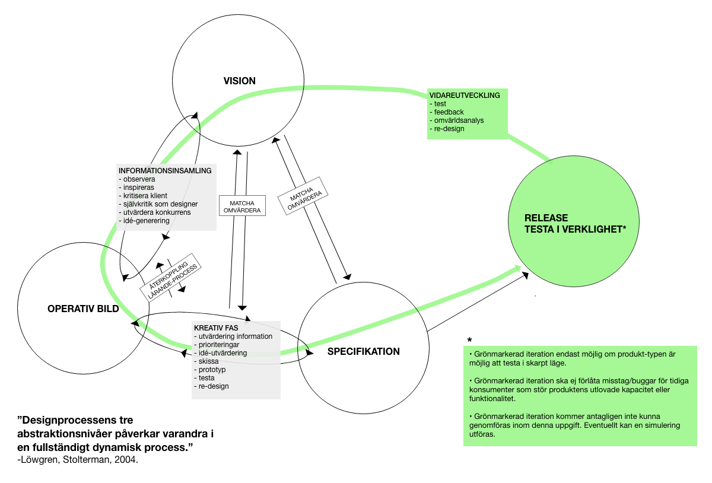
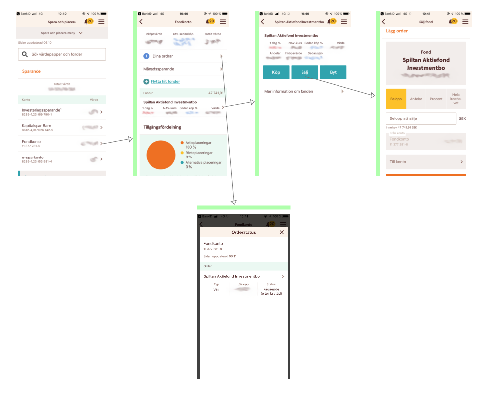
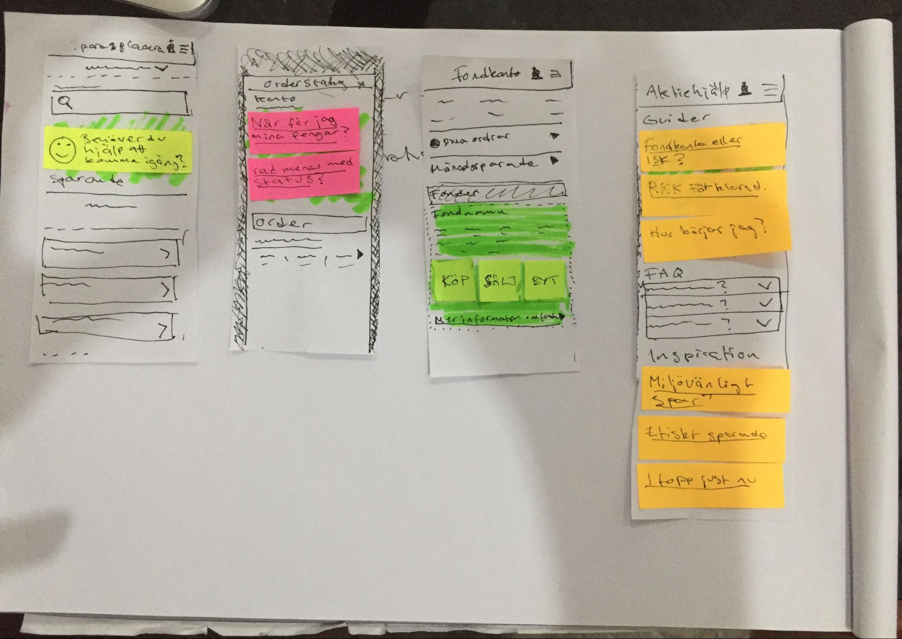
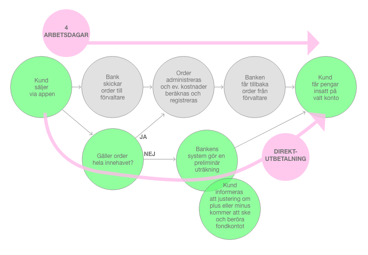
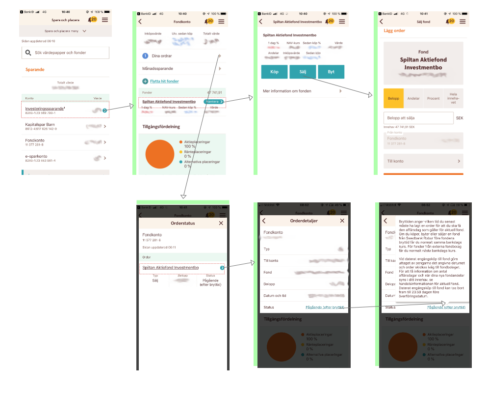

# University work, analyze and re-design with Normans design principles as reference.

Delprov 2 (3 hp) Anv&auml;ndarcentrerad design ID404F

Namn: FREDRIK LARSSON&nbsp;&nbsp;&nbsp;&nbsp;&nbsp;&nbsp;&nbsp;&nbsp;

Del A

ANV&Auml;NDARCENTRERADE DESIGNPROCESSEN

&nbsp;Bild 1. Illustration av design av designprocess.

ANV&Auml;NDNINGSSAMMANHANGET/BRUKSSITUATIONEN:

Bankkunder som vill s&auml;lja delar eller hela innehavet av sparande i fonder. Jag utg&aring;r fr&aring;n scenariot att fonderna s&auml;ljs med anledning att anv&auml;ndaren beh&ouml;ver likviderna br&aring;dskande baserat p&aring; antagandet att en konventionellt anv&auml;nder sparformen fonder f&ouml;r ett l&aring;ngsiktigt sparande med ett tydligt m&aring;l. S&aring; ett uttag kan tyda p&aring; en pengabrist just i det tillf&auml;llet. Det hela utf&ouml;rs i bank-appen p&aring; en telefon. P&aring; ett emotionellt plan kan situtionen eller k&auml;nslan hos anv&auml;ndaren ofta antagas vara stressad.

ANV&Auml;NDAREN:

Jenny, frilansande fotograf.&nbsp;Kvinna, singel, 38 &aring;r uppvuxen och boende i Sverige. Egenf&ouml;retagare med kortare frilansuppdrag som journalist, arbetar ofta p&aring; resande fot s&aring;v&auml;l utomlands som inrikes. En livsstil som ger en mindre trygg ekonomisk situation, sv&aring;rt med l&aring;ngsiktiga ekonomiska planer d&aring; arbetsbrist kan uppst&aring; och buffertar ofta t&ouml;ms. Efter en l&auml;ngre tid utan en lugn tillvaro p&aring; en och samma plats b&ouml;rjar med &aring;ldern en l&auml;ngtan efter en lugnare och tryggare tillvaro uppst&aring;. F&ouml;r att etablera en s&aring;dan kr&auml;vs ett grundkapital och d&auml;rav behovet att spara pengar.

ARTEFAKTEN:

Hantering vid f&ouml;rs&auml;ljning av fonder i Swedbanks bank-app &auml;r en funktion under menyvalet &ldquo;spara och placera&rdquo;. Det &auml;r en liten del av applikationens stora omf&aring;ng. I den kan bankens kunder hantera det mesta vad g&auml;ller privatekonomi (jag kan endast belysa produkten f&ouml;r privatpersoner, &auml;ven om den &auml;ven st&ouml;djer f&ouml;retagskonton) som betalningar, tj&auml;nster och sparande. M&ouml;jliga anv&auml;ndare kan ha v&auml;ldigt olika bakgrund, referenser och kunskaper. Fl&ouml;det som jag kommer att ta en n&auml;rmare titt p&aring; syns nedan i bild 2 i form av sk&auml;rmdumpar. Det visar stegen f&ouml;r att s&auml;lja fonder.

Bild 2. Illustration av fl&ouml;de vid f&ouml;rs&auml;ljning av fonder i Swedbanks bank-app.

<h2 class="c18 c25" id="h.t6v0i2x4xqxh"></h2><h2 class="c18 c27" id="h.74d1vlyr2l4g">DISCOVERABILITY</h2>

GESTALTNING

&nbsp;

Bild 3. Pappersprototyp med ut&ouml;kad hj&auml;lp f&ouml;r anv&auml;ndare.

ARGUMENTATION

Att handla med aktier kan f&ouml;r den okunnige vara en skr&auml;mmande upplevelse, s&aring; pass skr&auml;mmande att en avst&aring;r helt att ens f&ouml;rs&ouml;ka &auml;ven om lusten faller p&aring;. Om en tar fram en design f&ouml;r en tj&auml;nst d&auml;r anv&auml;ndaren riskerar sitt satsade kapital ser jag h&auml;r en m&ouml;jlighet att nyttja denna lust hos anv&auml;ndaren f&ouml;r att locka denne till handling ur passivitet. 

The seven stages of action och discoverability

Genom att utg&aring; ifr&aring;n designprincipen discoverability och forma designen f&ouml;r uppt&auml;ckbarhet (undertecknads &ouml;vers&auml;ttning av discoverability) kan designern ge anv&auml;ndaren kunskap och trygghet. F&ouml;reslaget genom hj&auml;lpfunktioner och -information om tj&auml;nsten att erbjuda guider, inspiration och informerande artiklar som i prototypen i bild 3 ovan visar. S&aring; kan designen hj&auml;lpa anv&auml;ndaren genom stegen 1-4 i &ldquo;the seven stages of action&rdquo; (Norman 2013, sid 40-44). Stegen Norman presenterar &nbsp;&auml;r som f&ouml;ljer (undertecknads &ouml;vers&auml;ttning):
<ol class="c10 lst-kix_aua8axm79pg3-0 start" start="1"><li class="c2 c17">M&aring;l (forma m&aring;let)</li><li class="c2 c17">Planera (handlingen)</li><li class="c2 c17">Specificera (en t&auml;nkt sekvens av handlande)</li><li class="c2 c17">Genomf&ouml;r (Sekvens av handlande)</li></ol>
F&ouml;r min anv&auml;ndare &ldquo;Jenny&rdquo; som har liten erfarenhet av sparande och placering av kapital i fonder och v&auml;rdepapper &auml;r det kritiskt att hj&auml;lpa och stimulera genom dessa steg f&ouml;r att hon ska komma till genomf&ouml;randefasen (steg 4 ovan). I min prototyp har jag adderat information i gr&auml;nssnittet som hj&auml;lpfunktioner, guider och inspiration. Detta &auml;r integrerat huvudsakligen som artiklar i den situation eller det steg som artefakten befinner sig i d&auml;r det har relevans till handlingsm&ouml;jligheterna i steget. F&ouml;rslaget i prototypen har inte bara adderat detta. I f&ouml;rslaget har det tagits bort ett steg f&ouml;r att l&auml;gga till knapparna &ldquo;k&ouml;p&rdquo;, &ldquo;s&auml;lj&rdquo; och &ldquo;byt&rdquo; direkt i listningen av innehav. Det &auml;r dels f&ouml;r att anv&auml;ndaren inte ska beh&ouml;va ett extra klick f&ouml;r att uppt&auml;cka och n&aring; dessa handlingsm&ouml;jligheter. Men fr&auml;mst f&ouml;resl&aring;s &auml;ndringen f&ouml;r att i linje med Normans definition av &ldquo;discoverability&rdquo; g&ouml;ra att det f&ouml;r anv&auml;ndaren &auml;r m&ouml;jligt att avg&ouml;ra vilka g&auml;rningar/handlingar som &auml;r m&ouml;jliga att utf&ouml;ra och artefaktens tillst&aring;nd (It is possible to determine what actions are possible and the current state of the device)(Norman 2013, sid 72). Det &auml;r allts&aring; g&ouml;mt ett steg &ldquo;l&auml;ngre bort&rdquo; i on&ouml;dan enligt mig. Antagligen &auml;r detta f&ouml;r att listningen ska vara mer &ouml;versk&aring;dlig och fokus i detta steg ska vara innehav inte m&ouml;jliga handlingar. Men jag st&aring;r fast vid att det &auml;r av mer prio att inkludera dessa knappar i denna listning f&ouml;r att g&ouml;ra m&ouml;jligheterna mer &ouml;versk&aring;dliga och l&auml;tta att f&ouml;rst&aring;. En knapp som kan leda direkt till en funktion som samtidigt g&ouml;r gr&auml;nssnittet mer uppt&auml;ckbart &auml;r v&auml;rt att beh&aring;lla. Det &auml;r flera designprinciper som &ldquo;affordances&rdquo;, &ldquo;discoverability&rdquo; och &ldquo;signifiers&rdquo; som understryker det i detta fall vill jag p&aring;st&aring;. Knapparna kan designas om grafiskt f&ouml;r att ta mindre utrymme dock.

Feedforward och discoverability

Norman resonerar vidare om &ldquo;the seven stages of action as design aids&rdquo; (Norman 2013, sid 71, figur 2.7) och &ldquo;feedforward&rdquo;. Feedforward menar Norman f&ouml;ljer dessa steg (undertecknads &ouml;vers&auml;ttning):
<ol class="c10 lst-kix_j98kb89fymdw-0 start" start="1"><li class="c2 c17">Vad vill jag &aring;stadkomma?</li><li class="c2 c17">Vad &auml;r alternativen?</li><li class="c2 c17">Vad kan jag g&ouml;ra?</li><li class="c2 c17">Hur g&ouml;r jag det?</li></ol>
Om en ser till fl&ouml;det som en process att hantera fonder snarare &auml;n att bokstavligen se p&aring; gr&auml;nssnittet ger prototypens ut&ouml;kade utforskningsm&ouml;jligheter (discoverability) st&ouml;d f&ouml;r dessa aktiviteter eller svar p&aring; fr&aring;gorna. L&aring;t mig presentera svarsalternativ (textens bakgrundsf&auml;rger refererar till prototypens f&auml;rg p&aring; papperslapparna) utifr&aring;n prototypen i bild 3 till ovan st&auml;llda fr&aring;gest&auml;llningar:
<ol class="c10 lst-kix_7o76kpcfcicd-0 start" start="1"><li class="c2 c17">Vad vill jag &aring;stadkomma?</li></ol>
Spara i fonder, inspiration och hj&auml;lp finns som stimuli och svar i form av: 

&ldquo;Beh&ouml;ver du hj&auml;lp att komma ig&aring;ng?&rdquo;
<ol class="c10 lst-kix_7o76kpcfcicd-0" start="2"><li class="c2 c17">Vad &auml;r alternativen?</li></ol>
&nbsp;&nbsp;&nbsp;&nbsp;&nbsp;&nbsp;&nbsp;&nbsp;Svaren finns i de guidande artiklarna:

&nbsp;&nbsp;&nbsp;&nbsp;&nbsp;&nbsp;&nbsp;&nbsp;&ldquo;Fondkonto eller ISK?&rdquo;, &ldquo;Risker f&ouml;rklarade&rdquo; och &ldquo;hur b&ouml;rjar jag?&rdquo;
<ol class="c10 lst-kix_7o76kpcfcicd-0" start="3"><li class="c2 c17">Vad kan jag g&ouml;ra?</li></ol>
De tydliga &ldquo;k&ouml;p-&rdquo;, &ldquo;s&auml;lj-&rdquo;&nbsp;och&nbsp;&ldquo;byt-&rdquo;&nbsp;knapparna tillsammans med artiklar under orderstatus ger v&auml;gledning. &ldquo;N&auml;r f&aring;r jag mina pengar?&rdquo;, &ldquo;Vad menas med status?&rdquo;.
<ol class="c10 lst-kix_7o76kpcfcicd-0" start="4"><li class="c2 c17">Hur g&ouml;r jag det?</li></ol>
Sammantaget ovan n&auml;mnda hj&auml;lpavsnitt tillsammans med inspirationsavsnittet som kan ge anv&auml;ndaren en extra knuff att utf&ouml;ra handlingen att b&ouml;rja fondspara. Se f&ouml;reslagna artiklar:

&ldquo;Milj&ouml;v&auml;nligt spar&rdquo;, &ldquo;etiskt sparande&rdquo;&nbsp;och&nbsp;&ldquo;i topp just nu&rdquo;.&nbsp;

<h2 class="c27 c18" id="h.tikxsisaxj2b">FEEDBACK</h2>

GESTALTNING

&nbsp;

Bild 4. Alternarivt fl&ouml;de vid f&ouml;rs&auml;ljning av fonder i Swedbanks bank-app f&ouml;r att ge anv&auml;ndare snabb feedback och ut&ouml;kad service.

ARGUMENTATION

Om kapital kan sparas genom k&ouml;p av fonder men samtidigt g&aring; att s&auml;lja och f&aring; tillg&aring;ng till likviderna omedelbart kan f&ouml;r min anv&auml;ndare &ldquo;Jenny&rdquo; vara helt avg&ouml;rande huruvida hon v&auml;ljer att fondspara eller inte. Att kunna erbjuda en s&aring;dan flexibilitet ger en stark position konkurrensm&auml;ssigt om det kundsegment som vill och &auml;r redo att spara med risk men &auml;nd&aring; har en ekonomisk situation d&auml;r pengarna kan beh&ouml;vas akut till annat.
<h3 class="c18 c26" id="h.7wa1qj6oohuj">Variation p&aring; f&ouml;rv&auml;ntan beroende p&aring; mental modell</h3>
Om en knapp i gr&auml;nssnittet har texten &ldquo;s&auml;lj&rdquo; och anv&auml;ndaren matar in belopp, v&auml;ljer var pengarna ska s&auml;ttas in och trycker p&aring; den s&aring; ska en i m&ouml;jligast m&aring;n f&aring; som feedback att pengarna sedan finns tillg&auml;ngliga p&aring; valt utbetalningskonto. I swedbanks system tar det ist&auml;llet 4 dagar innan denna feedback ges och pengarna &auml;r tillg&auml;ngliga. Det &auml;r den tiden det tar f&ouml;r processen genom de gr&aring; bubblorna i bild 4 fr&aring;n fondinnehav till kontanter. Den f&ouml;rv&auml;ntade tiden f&ouml;r att pengarna ska betalas ut beror h&auml;r p&aring; en annan designprincip &auml;n feedback, den som bygger mycket kring kulturella referenser, kunskaper och erfarenheter. Det &auml;r n&auml;mligen vad Norman ben&auml;mner &ldquo;conceptual model&rdquo; (Norman 2013, sid 72) eller p&aring; svenska &ldquo;Mentala modeller&rdquo; (Arvola 2014, sid 123) som handlar om anv&auml;ndarens mentala bild av systemet. P&aring; engelska kan vi prata om Normans begrepp &ldquo;the system image&rdquo; (Norman 2013, sid 31) d&auml;r det beskrivs hur en designer m&aring;ste kunna kommunicera p&aring; n&aring;got vis till anv&auml;ndaren hur en produkt eller tj&auml;nst fungerar.

<h3 class="c24 c18" id="h.xlopdc84gp5">Design f&ouml;r maximal och snabb service f&ouml;r anv&auml;ndaren &nbsp;</h3>
Med min anv&auml;ndare i fokus som antas beh&ouml;va pengar br&aring;dskande i vissa fall, har jag valt att g&ouml;ra en design av fl&ouml;det som kringg&aring;r n&ouml;dv&auml;ndiga steg i orderprocessen f&ouml;r att ge snabbast m&ouml;jliga feedback i form av pengar p&aring; kontot f&ouml;r anv&auml;ndaren. Ordern g&aring;r sin g&aring;ng i bakgrunden och anv&auml;ndaren m&aring;ste informeras enligt Normans definition av &ldquo;feedback&rdquo; i citat 1 nedan om att summan fr&aring;n den prelimin&auml;ra utr&auml;kningen kan komma att justeras i efterhand. Denna service kan allts&aring; bara g&auml;lla med villkoret att det finns pengar kvar p&aring; fondkontot att g&ouml;ra eventuella justeringar. Vetskapen om att kapitalet inte &auml;r &ldquo;l&aring;st&rdquo; utan ist&auml;llet omedelbart tillg&auml;ngligt om det beh&ouml;vs akut &auml;r en service som kan f&aring; min anv&auml;ndare till handling och placera pengar i fondspar hos banken.

Feedback:

&ldquo;There&rsquo;s full and continuous information about the results of actions and the current state of the product or service.&rdquo;

Citat 1. Norman 2013, sid 72.

<h3 class="c26 c18" id="h.ma4pzvxgctxu">Feedforward blir feedback</h3><h3 class="c26 c18" id="h.kz25dslr7meb">Jag &aring;terv&auml;nder till &ldquo;the seven stages of action as design aids&rdquo; (Norman 2013, sid 71, figur 2.7) som diskuterades fr&aring;n steg 1-4 och feedforward ovan under f&ouml;rslaget utifr&aring;n &ldquo;Discoverability&rdquo;. P&aring; liknande vis besvarar jag steg 5-7 och hur denna design p&aring;verkar dessa feedback-steg:</h3><ol class="c10 lst-kix_t905f6sijf5c-0 start" start="1"><li class="c7"><h3 id="h.9jv4l1mxlt7w" style="display:inline">Vad h&auml;nde?</h3></li></ol>
Feedback i form av textbaserad information ger anv&auml;ndaren vetskap om att eventuell justering kan ske och p&aring;verkar i s&aring;na fall fondinnehavet. Pengarna fr&aring;n de s&aring;lda fonderna finns nu p&aring; valt konto.
<ol class="c10 lst-kix_t905f6sijf5c-0" start="2"><li class="c7"><h3 id="h.2243u6zgptu" style="display:inline">Vad betyder det?</h3></li></ol>
Kapitalet &auml;r flyttat och likvider finns tillg&auml;ngligt.
<ol class="c10 lst-kix_t905f6sijf5c-0" start="3"><li class="c7"><h3 id="h.byiyvfjf0scy" style="display:inline">&Auml;r det ok? Har jag n&aring;tt mitt m&aring;l?</h3></li></ol>
M&aring;let, att f&ouml;rflytta kapital fr&aring;n fondinnehav till kontanter p&aring; konto &auml;r uppfyllt. anv&auml;ndaren kan bruka dessa f&ouml;r syftet de togs ut f&ouml;r.

<h2 class="c27 c18" id="h.ojxqcwfy7e2w">SIGNIFIERS</h2>

GESTALTNING

&nbsp;

Bild 5. Illustration av uppdaterade signifiers f&ouml;r m&ouml;jliga handlingar.

ARGUMENTATION

En oerfaren fondsparare som anv&auml;ndaren &ldquo;Jenny&rdquo; beh&ouml;ver all sin uppm&auml;rksamhet och fokus f&ouml;r att ta till sig informationen som ges i artefaktens olika stadier d&aring; hon utforskar sparandets former och m&ouml;jligheter. Det finns inte utrymme att l&auml;gga energi p&aring; att utforska vad som &auml;r m&ouml;jligt i gr&auml;nssnittet, det &auml;r inneh&aring;llet som &auml;r viktigt f&ouml;r henne. Vad som &auml;r klickbart och vilka handlingar som &auml;r m&ouml;jliga f&ouml;r att n&aring; informationen &auml;r i fl&ouml;det f&ouml;r att s&auml;lja och i &ouml;vrigt hantera fonder, det &auml;r handlingsm&ouml;jligheter som ska uppfattas utan att kr&auml;va n&aring;got av anv&auml;ndarens uppm&auml;rksamhet.
<h3 class="c18 c24" id="h.cyywa338zuvo">Knappar som tydliga signaler</h3>
I m&aring;nga listningar av fondinnehavet finns det en handlingsm&ouml;jlighet med listade element. Dom &auml;r klickbara och leder en vidare till andra m&ouml;jligheter. Jag har i detta designf&ouml;rslag utg&aring;tt fr&aring;n principen signifiers f&ouml;r att &auml;ndra ett problem jag anser finns i gr&auml;nssnittet.

Som signifiers f&ouml;r klickbara listnings-element anv&auml;nds en h&ouml;gerpekande ikon. Denna ikon &auml;r nedtonad i f&auml;rg och diskret, jag tycker att det ser snyggt ut och anser att i befintlig design har det estetiska prioriterats framf&ouml;r tydlighet. Det bryter emot Normans teori &ldquo;mark&ouml;rer m&aring;ste vara uppfattbara, annars fungerar de inte&rdquo;(undertecknads &ouml;vers&auml;ttning)(Norman 2013, sid 19). Se citatet &aring;tergivet precis p&aring; engelska nedan i citat 2. Jag laborerade i mitt f&ouml;rslag med att byta ut ikonen mot en knapp i vissa fall och i andra f&ouml;rst&auml;rka den med f&auml;rg. B&aring;da dessa grafiska element har jag gett nytt utseende utifr&aring;n stilen p&aring; de befintliga knapparna &ldquo;k&ouml;p&rdquo;, &ldquo;s&auml;lj&rdquo; och &ldquo;byt&rdquo;. Detta g&ouml;r att de sm&auml;lter in bra i den grafiska designen och signalerar klart tydligare f&ouml;r anv&auml;ndaren att ytan &auml;r klickbar. F&ouml;r ytterligare f&ouml;rst&auml;rkning har jag gett texten en understrykning som konventionellt i l&aring;ng tid varit en symbol f&ouml;r klickbar l&auml;nk i webbsammanhang. Om en j&auml;mf&ouml;r bild 2 med bild 5 g&aring;r det att se hur jag fann nya navigationsm&ouml;jligheter vidare fr&aring;n &ldquo;orderstatus&rdquo; d&aring; jag utforskade gr&auml;nssnittet och aktivt s&ouml;kte signifiers. Detta hade jag antagligen inte missat i f&ouml;rsta hand om klickbara ytor varit tydligare signaler.

Normans definition av Signifier lyder &ldquo;Effective use of signifiers ensures discoverability and that the feedback is well communicated and intelligible&rdquo;(Norman 2013, sid 72) vilket binder samman och summerar mina f&ouml;rslag och dess designprinciper till ett m&ouml;jligt gemensamt f&ouml;rslag i en vidare iteration.

Signifiers:

&ldquo;signifiers must be perceivable, else they fail to function.&rdquo;

Citat 2. Norman 2013, sid 19.

Del B

Dokumentera tre exempel p&aring; l&auml;randebehov inom interaktionsdesign:

EXEMPEL 1 - UTVECKLA K&Auml;NSLA F&Ouml;R KVALITET

Jag &auml;r en person som kommit att intressera mig f&ouml;r interaktionsdesign utifr&aring;n den vinkeln att jag arbetat med konstn&auml;rliga uttrycksformer och grafisk design. Enligt resonemanget att &ldquo;om man &auml;r en mycket kreativ person [&hellip;] s&aring; kanske man ska satsa p&aring; att utveckla sin k&auml;nsla f&ouml;r kvalitet&rdquo;(L&ouml;wgren, Stolterman 2004, sid 60) s&aring; passar det bra in p&aring; mig. Jag ser tidigt framf&ouml;r mig det estetiska och kan fastna vid och h&aring;lla fast vid tidiga visioner baserat p&aring; det grafiska d&aring; jag hellre hade sett att jag hade l&aring;tit processen gjort fler f&ouml;rfinande iterationer f&ouml;r att skapa kvalitet f&ouml;r just den brukssituation och anv&auml;ndare en designar f&ouml;r. Under dessa iterationer hade de tidiga visionerna f&aring;tt &auml;ndrats en hel del, antagligen till det b&auml;ttre f&ouml;r brukaren &auml;ven om det kanske p&aring;verkat det estetiska negativt. Mitt f&ouml;rslag f&ouml;r &ldquo;signifiers&rdquo; ovan gjorde s&aring;ledes &ldquo;lite ont&rdquo; att skapa d&aring; det f&ouml;resl&aring;r tydlighet framf&ouml;r god estetik. 

EXEMPEL 2 - STRUKTUR OCH METOD

Under rubriken &ldquo;Alla har designf&ouml;rm&aring;ga&rdquo; skriver L&ouml;wgren &amp; Stolterman om hur vi alla som individer designar v&aring;ran tillvaro och v&aring;ra liv vilket g&ouml;r oss alla till n&aring;gon form av designer. Det utforskas &auml;ven huruvida det finns en &ldquo;designf&ouml;rm&aring;ga&rdquo; som vissa individer besitter(L&ouml;wgren, Stolterman 2004, sid 63-65). Detta resonemang om hur v&aring;ran vardag designas f&aring;r mig att t&auml;nka p&aring; och analysera hur personlighet hos designern p&aring;verkar arbetet. I mitt fall &auml;r likheten mellan personlighet och process stor. Jag &auml;r ostrukturerad och impulsiv i min vardag, med dessa drag i arbetet med design kan vissa utfall vara slarviga utan dokumentation och metodik som visar p&aring; och garanterar b&auml;sta m&ouml;jliga utfall. Om denna teori r&aring;der som sanning s&aring; har jag jobb att g&ouml;ra med mig sj&auml;lv som person i samband med att utvecklas som designer, eller tv&auml;rtom. 

EXEMPEL 3 - DOKUMENTATION AV PROCESS OCH IDE&Eacute;R

Jag gillar tanken som presenteras av L&ouml;wgren &amp; Stolterman att:

&ldquo;V&aring;r bild av designprocessen &auml;r ett komplext och helt dynamsikt skeende, d&auml;r visioner v&auml;xelverkar med operativa bilder och specifikationer i designsituationens sammanhang av individer, sociala och organisatoriska strukturer&rdquo;(L&ouml;wgren, Stolterman 2004, sid 219).

Bilden som m&aring;las upp &auml;r en vilt kreativ process p&aring; gr&auml;nsen till kaos, ett arbetss&auml;tt jag ofta &aring;terfinner mig sj&auml;lv i. Som tidigare n&auml;mnts (i exempel 2 ovan) b&ouml;r denna &ldquo;arbetsmetod&rdquo; &auml;ndras. I denna process gl&ouml;mmer jag ofta att dokumentera underlag som visar varf&ouml;r vissa val har gjorts. &Auml;ven id&eacute;er faller bort d&aring; de ej dokumenteras i r&auml;tt tid och sparas f&ouml;r att kunna &aring;terkomma till. 

Detta blir skadligt fr&auml;mst p&aring; tv&aring; s&auml;tt. F&ouml;rst att dokumentationen beh&ouml;vs f&ouml;r att senare kunna argumentera med medskapare och klienter varf&ouml;r det ser ut som det g&ouml;r, det kan allts&aring; ge arbetet trov&auml;rdighet. Sen s&aring; skadar &auml;ven id&eacute;bortfallet designprocessens iterativa art. F&ouml;rfinande arbete kanske aldrig g&ouml;rs d&aring; skisserna saknas helt enkelt. Det kan f&ouml;rklaras som att v&auml;gen fr&aring;n vision till specifikation sker f&ouml;r mycket i huvudet utan att arbeta med utv&auml;rdering av information, skisser och prototyper tillr&auml;ckligt f&ouml;r att skapa en tydlig operativ bild.

K&auml;llf&ouml;rteckning

Norman, Donald A. (2013). The Design of Everyday Things.

Arvola, Mattias. (2014). Interaktionsdesign och UX &ndash; om att skapa en god anv&auml;ndarupplevelse.

L&ouml;wgren, Jonas &amp; Stolterman, Erik. (2004), Design av informationsteknik : materialet utan egenskaper. 2 upplagan.
